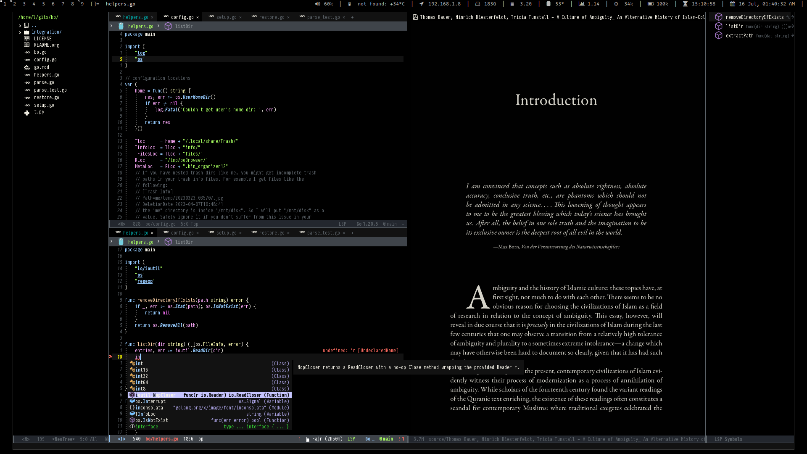

By now I&rsquo;ve to admit that documenting my dots has been nothing but a complete
joke. The commit history (still available in the `archived_main` branch) is
completely useless and objectiveless. Today (*(2023/05/20)*) I&rsquo;ve archived all
the old commits, starting with a clean that applies [Conventional Commits 1.0.0](https://www.conventionalcommits.org/en/v1.0.0/).

